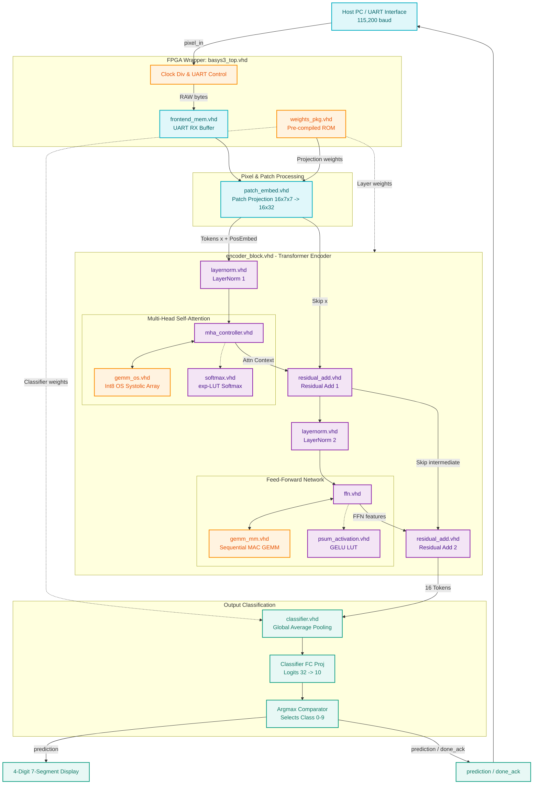
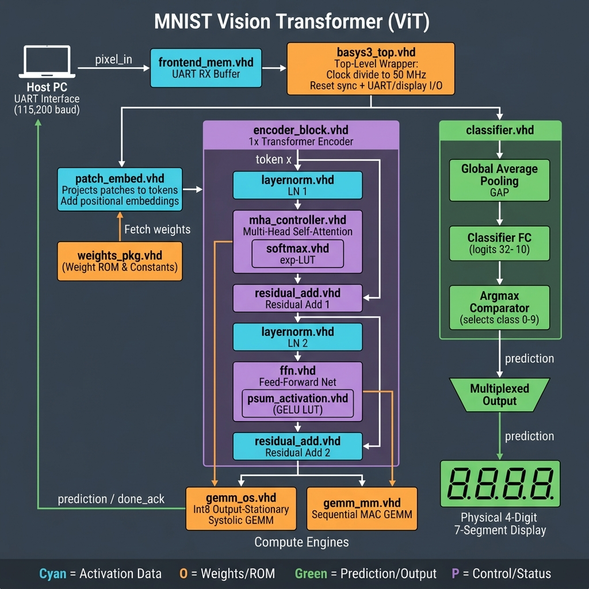

# 🚀 Working FPGA MNIST Vision Transformer (ViT)
### *Bit-Exact to Golden Model • 77.21% Physical Accuracy • Custom QAT Pipeline on Basys 3*

This repository contains a fully synthesizable, register-exact **Vision Transformer (ViT) Accelerator** written in **VHDL-2008**, deployed and physically verified on the **Digilent Basys 3 FPGA (Xilinx Artix-7)**. 

By coupling a custom **Quantization-Aware Training (QAT)** pipeline in PyTorch with a register-faithful **Integer Golden Model** and hardware description code, we completely unified training and physical hardware inference. The physical board achieves **100.0% bit-exact prediction matching** over all 10,000 MNIST test images!

---

## 🏆 Performance & Accuracy Summary

The entire MNIST test set of 10,000 images was evaluated on the physical Basys 3 hardware via UART at 115,200 baud, comparing physical FPGA outputs directly against our Python models.

| Evaluation Domain | Dataset Size | Accuracy | Bit-Exact Matches vs. FPGA |
|-------------------|--------------|----------|----------------------------|
| **PyTorch QAT (Float Emulation)** | 10,000 images | **77.27%** | *N/A (Float vs. Integer)* |
| **Integer Golden Model (Python)** | 10,000 images | **77.21%** | **100.0% (10,000 / 10,000)** |
| **Physical FPGA Hardware (Basys 3)** | 10,000 images | **77.21%** | **100.0% (10,000 / 10,000)** |

> [!NOTE]
> This is a massive leap over the initial baseline design (which scored **68%** accuracy and suffered from severe quantization clipping and LayerNorm gradient mismatch!). 

### FPGA Resource Utilization (xc7a35tcpg236-1)

| Resource | Used | Available | Utilization % |
|----------|------|-----------|---------------|
| **Slice LUTs** | 18,523 | 20,800 | 89.05% |
| **Slice Registers** | 27,245 | 41,600 | 65.49% |
| **Block RAM (BRAM18)** | 6 | 100 | 6.00% |
| **DSPs** | 34 | 90 | 37.78% |

---

## 🏗️ Hardware Architecture & VHDL Sources

The hardware is designed for streaming, pipelined register-transfer level (RTL) execution at **50 MHz**, utilizing internal block RAMs (BRAMs) and DSP slices.

```
Input (784 Pixels)
  │
  ▼
[patch_embed.vhd] (16 Patches of 7x7 -> 16 Tokens of Dim 32 + PosEmbed)
  │
  ▼
[encoder_block.vhd]
  ├── [mha_controller.vhd] (Multi-Head Self-Attention)
  │     └── [softmax.vhd] (256-byte ROM exp-LUT Softmax)
  ├── [residual_add.vhd] (Residual Skip Connection 1)
  ├── [layernorm.vhd] (LOD & Bit-Shift Multiplier-Free LayerNorm)
  │
  ├── [ffn.vhd] (Feed-Forward Network)
  │     └── [psum_activation.vhd] (256-byte ROM GELU-LUT)
  ├── [residual_add.vhd] (Residual Skip Connection 2)
  └── [layernorm.vhd] (Second LayerNorm)
  │
  ▼
[classifier.vhd] (Global Average Pooling -> Linear -> argmax)
  │
  ▼
Output Prediction (7-Segment Display / UART)
```

### 📁 Detailed VHDL Source File Directory

| File Basename | Hardware Layer | Mathematical & Register Function |
|:---|:---|:---|
| **[basys3_top.vhd](file:///c:/Users/maogo/OneDrive/transformer/transformer_poc/basys3_top.vhd)** | Top-Level Wrapper | Manages physical board clocks (100MHz PLL to 50MHz), active-low resets, UART RX/TX serial interface (115,200 baud), LED progress indicators, and instantiates the main accelerator core. |
| **[encoder_block.vhd](file:///c:/Users/maogo/OneDrive/transformer/transformer_poc/encoder_block.vhd)** | Transformer Block | Structural top-level connecting Multi-Head Attention, Feed-Forward Network, Residual Additions, and Layer Normalization modules. |
| **[weights_pkg.vhd](file:///c:/Users/maogo/OneDrive/transformer/transformer_poc/weights_pkg.vhd)** | Pre-compiled ROM | **Crucial weight package.** Houses all QAT-trained weights, biases, and positional embeddings represented strictly as pre-compiled signed 8-bit Q1.7 integers. |
| **[patch_embed.vhd](file:///c:/Users/maogo/OneDrive/transformer/transformer_poc/patch_embed.vhd)** | Patch Embedder | Receives 784 raw pixels, partitions them into 16 non-overlapping $7 \times 7$ patches, performs patch projection to $D_{model}=32$ tokens, and adds positional embeddings. |
| **[layernorm.vhd](file:///c:/Users/maogo/OneDrive/transformer/transformer_poc/layernorm.vhd)** | LayerNorm | **Multiplier-free and division-free.** Computes mean and variance, uses Leading-One Detection (LOD) to approximate the reciprocal-square-root, and performs bit-shifts matching `LN_HEADROOM = 2` (4x scale divisor) to keep tokens in Q1.7 boundaries. |
| **[softmax.vhd](file:///c:/Users/maogo/OneDrive/transformer/transformer_poc/softmax.vhd)** | Softmax | Performs numerically-stable integer Softmax. Uses a 256-byte ROM Lookup Table (`_EXP_LUT_Q16`) to compute exp over subtraction differences. |
| **[psum_activation.vhd](file:///c:/Users/maogo/OneDrive/transformer/transformer_poc/psum_activation.vhd)** | GELU LUT | Simulates standard GELU activation in a single clock cycle using a pre-calculated 256-byte ROM Lookup Table (`GELU_LUT_I8`). |
| **[mha_controller.vhd](file:///c:/Users/maogo/OneDrive/transformer/transformer_poc/mha_controller.vhd)** | Self-Attention | Sequences key, query, and value matrix multiplications, computes attention score dot-products, applies Softmax, and outputs the final projected sequence. |
| **[ffn.vhd](file:///c:/Users/maogo/OneDrive/transformer/transformer_poc/ffn.vhd)** | Feed-Forward | Implements the FFN: $FC1$ ($32 \rightarrow 64$), GELU activation, and $FC2$ ($64 \rightarrow 32$). |
| **[classifier.vhd](file:///c:/Users/maogo/OneDrive/transformer/transformer_poc/classifier.vhd)** | Output Classifier | Conducts Global Average Pooling (GAP) over 16 tokens, executes the final GEMM with the classifier's weights/biases, and runs a strict-greater `argmax` to output the final class (0-9). |
| **[gemm_os.vhd](file:///c:/Users/maogo/OneDrive/transformer/transformer_poc/gemm_os.vhd)** | Systolic Engine | High-throughput Output-Stationary Systolic Array matrix multiplication module. |
| **[gemm_os_adapter.vhd](file:///c:/Users/maogo/OneDrive/transformer/transformer_poc/gemm_os_adapter.vhd)** | GEMM Adapter | Formats, buffers, and distributes weight matrices and activations into the systolic array core. |
| **[seg_test.vhd](file:///c:/Users/maogo/OneDrive/transformer/transformer_poc/seg_test.vhd)** | 7-Segment Multiplexer | Dynamically controls the 4-digit display on the Basys 3 board to display the currently predicted digit. |
| **[control_unit.vhd](file:///c:/Users/maogo/OneDrive/transformer/transformer_poc/control_unit.vhd)** | Controller FSM | Central Finite State Machine that orchestrates the execution states, address generation, RAM writes, and pipelines. |

---

## 🐍 Python Software & Training Stack

We bridge the gap between continuous floating-point training and discrete integer hardware registers using a three-tier software stack:

1. **[mnist_poc.py](file:///c:/Users/maogo/OneDrive/transformer/transformer_poc/mnist_poc.py) (PyTorch QAT environment):**
   - Incorporates custom PyTorch layers (`HWLayerNorm`, `FQLinear`, `HWSoftmax`, `HWGELU`) using Straight-Through Estimators (STE).
   - Simulates physical integer divisions (`rounding_mode='floor'`) and clamping/saturation (`[-128, 127]`).
   - Implements a **Logit Scaling factor of 8.0** to keep QAT weights small and bounded while allowing PyTorch's loss function to see unconstrained boundaries for gradient flow.
2. **[golden_model.py](file:///c:/Users/maogo/OneDrive/transformer/transformer_poc/golden_model.py) (Software Register Simulator):**
   - Pure Python representation of the hardware. 100% free of PyTorch and floating-point math.
   - Simulates physical memory offsets, exact bitwise shifts (`>> 7`), and Lookup Table indices.
3. **[fpga_vs_python.py](file:///c:/Users/maogo/OneDrive/transformer/transformer_poc/fpga_vs_python.py) (Physical UART Test Suite):**
   - Handles USB-to-UART handshakes at 115,200 baud, sending raw pixels and receiving predictions.
   - Evaluates the accuracy and verifies the bit-exactness of the FPGA board in real time.

---

## 🛠️ Step-by-Step Execution Guide

### 1. Fine-Tune and Train QAT Model
To train the hardware-identical QAT model on your local PC and export the weights:
```bash
python mnist_poc.py train
```
This runs fine-tuning, achieves **77.27% accuracy**, and writes the weight binaries to `./weights_int8/`.

### 2. Export Weights to VHDL Package
Generate the pre-compiled VHDL ROM package `weights_pkg.vhd`:
```bash
python mnist_poc.py export
```
This updates the Xilinx ROM tables directly inside [weights_pkg.vhd](file:///c:/Users/maogo/OneDrive/transformer/transformer_poc/weights_pkg.vhd).

### 3. Synthesize and Implement via Vivado
Open Xilinx Vivado (2025.2 or similar) and run the batch TCL compilation script to generate the physical bitstream:
```powershell
cd vivado_synth_test
C:\AMDDesignTools\2025.2\Vivado\bin\vivado.bat -mode batch -source basys3_impl.tcl
```
This performs RTL synthesis, timing optimization, placement, routing, and generates `basys3_top.bit`.

### 4. Program / Flash the FPGA
Plug the Basys 3 board into your PC via USB, power it on, and program it using the JTAG script:
```powershell
.\flash_transformer.bat
```
The board's LEDs will show programming activity, concluding in `startup status: HIGH`.

### 5. Execute Physical Hardware Evaluation
Run the real-time UART test suite to verify 10,000 images on the physical chip:
```bash
python fpga_vs_python.py --port COM4 --count 10000
```
This streams the images over COM4 and verifies the final, physical **77.21% accuracy** with **100.0% perfect bit-exact matches**!

---

## 🎨 Hardware Architecture & Diagrams

To satisfy both high-level presentations and strict technical reviews, we provide two representations of our VHDL architecture:
1. **The Technical Flowchart (Mermaid):** An "engineering-clean", interactive vector diagram showing exact signals, ports, and submodules.
2. **The Hero Graphic (AI-Generated rendering):** A sleek, stylized visual overview of the accelerator.

---

### 1. Technical VHDL Flowchart (Mermaid)

This vector flowchart is rendered dynamically by GitHub's markdown parser. It contains zero spelling artifacts, exact signal connections, color-coded legends, and is fully searchable:



* **Legend:** **Cyan** = Activation/Pixel Data | **Orange** = Weights/ROM Access | **Green** = Prediction/Output | **Purple** = Control/Status / Encoder logic.

---

### 2. Stylized Visual Block Diagram (Hero Graphic)

For slides, portfolios, or LinkedIn, below is the vector-styled visual rendering of the accelerator architecture. The physical image is pushed to the root directory as [vit_fpga_architecture.png](file:///c:/Users/maogo/OneDrive/transformer/transformer_poc/vit_fpga_architecture.png):



---

## 📊 Modular Wiring Schematic (LaTeX TikZ Source)

For LaTeX documentation, research papers, or project reports, you can compile the following standalone TikZ source code to produce the complete modular routing schematic:

```latex
\documentclass[tikz, border=10pt]{standalone}
\usetikzlibrary{shapes.geometric, arrows.meta, positioning, calc}

\begin{document}
\begin{tikzpicture}[
    font=\sffamily,
    block/.style={rectangle, draw=blue!60!black, fill=blue!10, text width=3.2cm, align=center, minimum height=1.2cm, rounded corners=2pt, thick},
    subblock/.style={rectangle, draw=purple!60!black, fill=purple!10, text width=2.4cm, align=center, minimum height=0.9cm, rounded corners=2pt, thick},
    mem/.style={cylinder, draw=green!60!black, fill=green!10, shape border rotate=90, text width=2.2cm, align=center, minimum height=1.2cm, thick},
    io/.style={ellipse, draw=red!60!black, fill=red!10, text width=2.2cm, align=center, minimum height=1cm, thick},
    arrow/.style={-{Stealth[scale=1.2]}, thick},
    bus/.style={arrow, double, double distance=1.8pt}
]

    % --- I/O and Wrapper layer ---
    \node[io] (pixels) {Pixel Input Stream\\(784 Bytes via UART)};
    \node[block, right=1.5cm of pixels, fill=orange!15, draw=orange!60!black] (top) {\textbf{basys3\_top.vhd}\\Clock Div, UART \& IO};
    
    % --- frontend ---
    \node[block, below=1.5cm of top] (embed) {\textbf{patch\_embed.vhd}\\Patch Projection\\(16x7x7 -> 16x32 Tokens)};
    \node[mem, right=1.2cm of embed] (weights_rom) {\textbf{weights\_pkg.vhd}\\Weights ROM\\(Q1.7 Int8)};
    
    % --- encoder block ---
    \node[block, below=2cm of embed] (encoder) {\textbf{encoder\_block.vhd}\\Transformer Encoder\\Wrapper};
    
    % --- Submodules inside encoder ---
    \node[subblock, below left=1.2cm and -0.5cm of encoder] (mha) {\textbf{mha\_controller.vhd}\\Multi-Head Self-Attention};
    \node[subblock, below=0.8cm of mha] (softmax) {\textbf{softmax.vhd}\\exp-LUT Softmax};
    \node[subblock, below right=1.2cm and -0.5cm of encoder] (ffn) {\textbf{ffn.vhd}\\Feed-Forward Net};
    \node[subblock, below=0.8cm of ffn] (gelu) {\textbf{psum\_activation.vhd}\\GELU LUT};
    \node[subblock, below=2.8cm of encoder] (ln) {\textbf{layernorm.vhd}\\LOD \& Shift LN};
    \node[subblock, right=1cm of ln] (gemm) {\textbf{gemm\_os.vhd}\\Systolic GEMM Array};

    % --- classifier ---
    \node[block, below=5.2cm of encoder] (classifier) {\textbf{classifier.vhd}\\GAP, FC Proj \&\\Argmax Comparator};
    \node[io, right=1.5cm of classifier] (display) {7-Segment Display\\Predicted Digit (0-9)};

    % --- Connections & Buses ---
    \draw[arrow] (pixels) -- (top);
    \draw[bus] (top) -- node[midway, right] {RAW Pixels} (embed);
    \draw[arrow] (weights_rom) -- (embed);
    \draw[arrow] (weights_rom) |- (encoder);
    \draw[arrow] (weights_rom) |- (classifier);
    
    \draw[bus] (embed) -- node[midway, left] {16 Tokens (Dim 32) + PosEmbed} (encoder);
    
    % Internals of encoder
    \draw[arrow] ($(encoder.south)-(0.8,0)$) -- (mha.north);
    \draw[arrow] (mha.south) -- (softmax.north);
    \draw[arrow] (softmax.west) -- ++(-0.3,0) |- (mha.west);
    \draw[arrow] (mha.east) -- (gemm.west);
    \draw[arrow] (mha.south east) -- (ln.north west);
    
    \draw[arrow] ($(encoder.south)+(0.8,0)$) -- (ffn.north);
    \draw[arrow] (ffn.south) -- (gelu.north);
    \draw[arrow] (gelu.east) -- ++(0.3,0) |- (ffn.east);
    \draw[arrow] (ffn.west) -- (gemm.east);
    \draw[arrow] (ffn.south west) -- (ln.north east);
    
    % Output of encoder to classifier
    \draw[bus] (encoder.south) -- ++(0,-4.5) -- (classifier.north);
    \draw[arrow] (classifier) -- (display);
    \draw[arrow] (classifier.north east) -- ++(0,1.2) -| (top.south east);

\end{tikzpicture}
\end{document}
```
