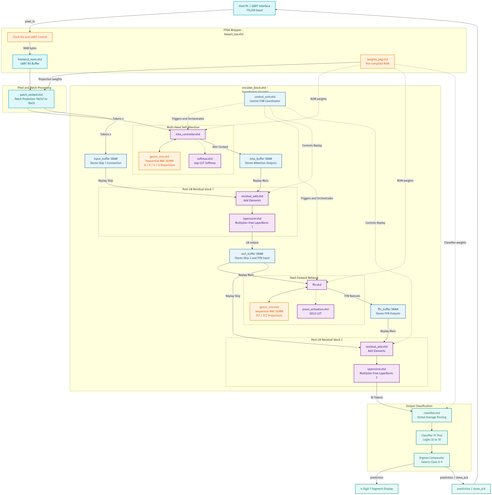
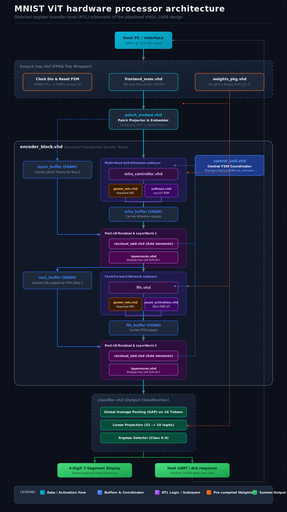

# FPGA MNIST Vision Transformer (ViT) — Basys 3 / Artix-7

A personal hobby project exploring an end-to-end training-to-silicon flow for a small Vision Transformer.

This repository contains a synthesizable Vision Transformer (ViT) inference accelerator written in VHDL-2008 and run on the Digilent Basys 3 FPGA (Xilinx Artix-7). A custom Quantization-Aware Training (QAT) pipeline in PyTorch is paired with an integer "golden model" in plain Python, so the same integer datapath exists in three forms: the training emulation, the software reference, and the RTL.

On the MNIST test set, the FPGA output matches the integer golden model on all 10,000 images, and both reach 77.21% accuracy.

---

## Performance & Accuracy

The MNIST test set (10,000 images) was streamed to the Basys 3 over UART at 115,200 baud and the board's predictions were compared against the Python reference models.

| Evaluation Domain | Dataset Size | Accuracy | Matches vs. FPGA |
|-------------------|--------------|----------|------------------|
| PyTorch QAT (float emulation) | 10,000 images | 77.27% | n/a (float vs. integer) |
| Integer golden model (Python) | 10,000 images | 77.21% | 10,000 / 10,000 |
| FPGA hardware (Basys 3) | 10,000 images | 77.21% | 10,000 / 10,000 |

> [!NOTE]
> An early version scored around 68%. Fixing a quantization-clipping issue and a LayerNorm mismatch in the QAT pipeline brought it to 77.21%, at which point the FPGA and the integer reference agree on every test image.

### FPGA Resource Utilization (xc7a35tcpg236-1)

| Resource | Used | Available | Utilization |
|----------|------|-----------|-------------|
| Slice LUTs | 18,523 | 20,800 | 89.05% |
| Slice Registers | 27,245 | 41,600 | 65.49% |
| Block RAM (BRAM18) | 6 | 100 | 6.00% |
| DSPs | 34 | 90 | 37.78% |

The LUT budget is fairly tight on this part; the design fits but does not leave much room to grow.

---

## Hardware Architecture & VHDL Sources

The datapath runs at 50 MHz and uses internal block RAMs and DSP slices.

```
Input (784 Pixels)
  │
  ▼
[patch_embed.vhd] (16 Patches of 7x7 -> 16 Tokens of Dim 32 + PosEmbed)
  │
  ▼
[encoder_block.vhd]
  ├── [mha_controller.vhd] (Multi-Head Self-Attention)
  │     └── [softmax.vhd] (256-byte ROM exp-LUT Softmax)
  ├── [residual_add.vhd] (Residual Skip Connection 1)
  ├── [layernorm.vhd] (LOD & Bit-Shift Multiplier-Free LayerNorm)
  │
  ├── [ffn.vhd] (Feed-Forward Network)
  │     └── [psum_activation.vhd] (256-byte ROM GELU-LUT)
  ├── [residual_add.vhd] (Residual Skip Connection 2)
  └── [layernorm.vhd] (Second LayerNorm)
  │
  ▼
[classifier.vhd] (Global Average Pooling -> Linear -> argmax)
  │
  ▼
Output Prediction (7-Segment Display / UART)
```

### VHDL Source Files

| File Basename | Hardware Layer | Function |
|:---|:---|:---|
| [basys3_top.vhd](basys3_top.vhd) | Top-Level Wrapper | Board clocking (100 MHz PLL to 50 MHz), active-low resets, UART RX/TX (115,200 baud), LED status indicators, and instantiation of the accelerator core. |
| [encoder_block.vhd](encoder_block.vhd) | Transformer Block | Structural top level connecting Multi-Head Attention, the Feed-Forward Network, the residual additions, and Layer Normalization. |
| [weights_pkg.vhd](weights_pkg.vhd) | Pre-compiled ROM | Holds the QAT-trained weights, biases, and positional embeddings as signed 8-bit Q1.7 integers. |
| [patch_embed.vhd](patch_embed.vhd) | Patch Embedder | Takes 784 raw pixels, splits them into 16 non-overlapping $7 \times 7$ patches, projects each to a $D_{model}=32$ token, and adds the positional embeddings. |
| [layernorm.vhd](layernorm.vhd) | LayerNorm | Multiplier-free and division-free. Computes mean and variance, uses Leading-One Detection (LOD) to approximate the reciprocal square root, and bit-shifts according to `LN_HEADROOM = 2` (a 4x scale divisor) to keep tokens within Q1.7 range. |
| [softmax.vhd](softmax.vhd) | Softmax | Numerically stable integer Softmax using a 256-byte ROM lookup table (`_EXP_LUT_Q16`) to evaluate exp over score differences. |
| [psum_activation.vhd](psum_activation.vhd) | GELU LUT | Approximates GELU in a single clock cycle via a 256-byte ROM lookup table (`GELU_LUT_I8`). |
| [mha_controller.vhd](mha_controller.vhd) | Self-Attention | Sequences the key/query/value matrix multiplications, computes the attention score dot products, applies Softmax, and produces the projected sequence. |
| [ffn.vhd](ffn.vhd) | Feed-Forward | The FFN: $FC1$ ($32 \rightarrow 64$), GELU, and $FC2$ ($64 \rightarrow 32$). |
| [gemm_mm.vhd](gemm_mm.vhd) | GEMM Engine | The matrix-multiply core used by the design: a sequential, memory-mapped multiply-accumulate (MAC) unit that iterates over $M \times N \times K$ cycles using DSP blocks, which keeps LUT usage low. |
| [classifier.vhd](classifier.vhd) | Output Classifier | Global Average Pooling (GAP) over the 16 tokens, the final GEMM with the classifier weights/biases, and a strict-greater `argmax` for the output class (0–9). |
| [seg_test.vhd](seg_test.vhd) | 7-Segment Multiplexer | Drives the Basys 3 4-digit display to show the predicted digit. |
| [control_unit.vhd](control_unit.vhd) | Controller FSM | Finite state machine coordinating execution states, address generation, RAM writes, and pipelining. |
| *[gemm_os.vhd](gemm_os.vhd)* | Concept only (unused) | An earlier output-stationary systolic-array implementation. Not instantiated in the active design. |
| *[gemm_os_adapter.vhd](gemm_os_adapter.vhd)* | Concept only (unused) | The adapter for that systolic array. Not instantiated in the active design. |

---

## Python Software & Training Stack

The path from floating-point training to the integer hardware datapath is covered by three Python pieces:

1. [mnist_poc.py](mnist_poc.py) — PyTorch QAT environment:
   - Custom PyTorch layers (`HWLayerNorm`, `FQLinear`, `HWSoftmax`, `HWGELU`) using Straight-Through Estimators (STE).
   - Emulates the integer divisions (`rounding_mode='floor'`) and the `[-128, 127]` clamping/saturation of the hardware.
   - A logit-scaling factor of 8.0 keeps the QAT weights small while still giving the loss enough range for gradient flow.
2. [golden_model.py](golden_model.py) — software register simulator:
   - Plain Python reference for the hardware. PyTorch-free; the inference path is integer-only (floats appear only in one-time GELU/softmax LUT construction and input-pixel normalization).
   - Models the memory offsets, the exact bit shifts (`>> 7`), and the lookup-table indices used by the RTL.
3. [fpga_vs_python.py](fpga_vs_python.py) — UART test harness:
   - Handles the USB-to-UART exchange at 115,200 baud, sending raw pixels and reading back predictions.
   - Compares the board against the golden model and reports accuracy and agreement.

---

## Build & Run

### 1. Train the QAT model
Train the hardware-matched QAT model and export the weights:
```bash
python mnist_poc.py train
```
This fine-tunes the model (about 77.27% accuracy) and writes the weight binaries to `./weights_int8/`.

### 2. Export weights to the VHDL package
Regenerate the VHDL ROM package `weights_pkg.vhd`:
```bash
python mnist_poc.py export
```
This rewrites the ROM tables inside [weights_pkg.vhd](weights_pkg.vhd).

### 3. Synthesize and implement in Vivado
Open Xilinx Vivado (2025.2 or similar) and run the batch TCL script to build the bitstream:
```powershell
cd vivado_synth_test
C:\AMDDesignTools\2025.2\Vivado\bin\vivado.bat -mode batch -source basys3_impl.tcl
```
This runs synthesis, placement, and routing, and produces `basys3_top.bit`.

### 4. Program the FPGA
Connect the Basys 3 over USB, power it on, and program it via the JTAG script:
```powershell
.\flash_transformer.bat
```
The board LEDs show programming activity and end at `startup status: HIGH`.

### 5. Run the hardware evaluation
Run the UART harness to evaluate the 10,000 test images on the board:
```bash
python fpga_vs_python.py --port COM4 --count 10000
```
This streams the images over COM4 and reports the 77.21% accuracy and the per-image agreement with the golden model.

---

## Architecture Diagrams

Two views of the same design:
1. Flowchart — signals, ports, and submodules at a glance.
2. Detailed schematic — clock domains, ROM access, control paths, and SRAM buffers.

---

### 1. Flowchart

Signals, ports, and submodules, with a color-coded legend:



* Legend: Cyan = activation/pixel data | Orange = weights/ROM access | Green = prediction/output | Purple = control/status and encoder logic | Blue = control unit and local SRAM buffers.

---

### 2. Vector Schematic (SVG)

A vector schematic of the dataflow, clock domains, weights-ROM access, control paths, and internal SRAM buffers:


